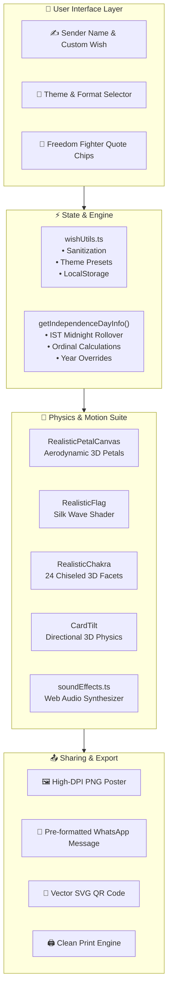

<div align="center">

# 🇮🇳 Happy Independence Day
### *An Apple-Grade Patriotic Greeting Card Studio & Heritage Celebration Platform*

<p align="center">
  <strong>Celebrate India's freedom with luxury handcrafted greeting cards, real-time 3D perspective physics, authentic silk Tiranga flutter, Web Audio fanfare synthesizers, and perpetual multi-year countdown.</strong>
</p>

<p align="center">
  <a href="https://react.dev/"></a>
  <a href="https://www.typescriptlang.org/"></a>
  <a href="https://vitejs.dev/"></a>
  <a href="https://tailwindcss.com/"></a>
  <a href="https://vitest.dev/"></a>
  <a href="LICENSE"></a>
  <a href="https://github.com/Rahul08319/Happy_Independence_Day/pulls"></a>
</p>

---

<p align="center">
  
</p>

<p align="center">
  <a href="#-key-features"><b>✨ Key Features</b></a> •
  <a href="#-realistic-motion--physics-engine"><b>🌸 Realistic Motion & Physics</b></a> •
  <a href="#-luxury-themes-showcase"><b>🎨 Themes Showcase</b></a> •
  <a href="#-interactive-url-query-api"><b>🔗 Deep-Link API</b></a> •
  <a href="#-quick-start"><b>🚀 Quick Start</b></a> •
  <a href="#-architecture--tech-stack"><b>⚡ Architecture</b></a>
</p>

</div>

---

## 📖 Overview

> *"Freedom is not merely a political status, but a celebration of spirit, unity, and heritage."*

**Happy Independence Day** re-imagines festive greetings as an **Apple-grade, tactile web application**. Built from scratch with **React 18**, **TypeScript**, and **Tailwind CSS**, it combines authentic Indian cultural motifs with cutting-edge web craftsmanship:

- 🎴 **Real-time 3D Card Studio**: Design bespoke tricolor greeting cards with directional dynamic shadows, Fresnel specular sheen, and live preview as you type.
- 🚩 **Ceremonial Flag Hoisting (ध्वजारोहण)**: An interactive golden mast ceremony featuring an unfurling silk Tiranga with traveling wave light ripples, flower petal shower, and trumpet fanfare.
- 🌸 **Pushpa Vrishti (Flower Shower Simulator)**: Natural aerodynamic petal simulation with terminal velocity drag, 3D tumbling, and authentic Marigold (genda) & Rose petal geometry.
- ⏱️ **Perpetual Multi-Year Countdown Engine**: Automatically calculates future Independence Day years, dates, and grammatical ordinals (*79th* in 2026, *80th* in 2027, *100th Centenary* in 2047) with midnight IST rollover and Apple Watch rolling odometer digits.
- 🎵 **Glassmorphic Audio Dock**: Streams an instrumental rendition of *Vande Mataram* with 4-band animated audio visualizer waves and polite autoplay detection.
- 📱 **Instant WhatsApp Sharing & QR Codes**: 100% client-side URL encoded sharing with scannable vector QR codes and high-DPI poster image exports.

---

## ✨ Key Features

<table>
  <tr>
    <td width="50%" valign="top">
      <h3>🎨 4 Luxury Handcrafted Themes</h3>
      <p>Seamlessly switch between <b>Royal Tiranga</b> (Gold Leaf Foil), <b>Midnight Glow</b> (OLED Sapphire), <b>Heritage Ivory</b> (Antique Khadi), and <b>Vibrant Flag</b> styles with real-time canvas re-rendering.</p>
    </td>
    <td width="50%" valign="top">
      <h3>⚡ Real-Time Live Preview Studio</h3>
      <p>Watch your greeting card materialize instantly as you type names, adjust quotes, select commemorative seals, or toggle aspect ratios.</p>
    </td>
  </tr>
  <tr>
    <td width="50%" valign="top">
      <h3>🚩 Interactive Flag Hoist (ध्वजारोहण)</h3>
      <p>Ceremonial flag hoisting on a multi-tiered Makrana marble & brass mast. Tapping <i>Hoist Flag</i> ascends the folded banner, unfurls silk cloth in 3D, showers petals, and plays bugle fanfare audio.</p>
    </td>
    <td width="50%" valign="top">
      <h3>🌸 Realistic Pushpa Vrishti</h3>
      <p>Custom physics canvas simulating 3D aerodynamic flutter of <b>scalloped Marigold petals</b>, <b>velvety cupped Rose petals</b>, and <b>Mogra petals</b> with natural wind sway and subsurface translucency.</p>
    </td>
  </tr>
  <tr>
    <td width="50%" valign="top">
      <h3>☸️ 3D Sculpted Ashoka Chakra</h3>
      <p>24 dual-facet chiseled spokes with light and shadow relief, 24 perimeter golden beads, milled concentric brass bevels, acoustic harmonic chimes, and speed-up gyro spin on tap.</p>
    </td>
    <td width="50%" valign="top">
      <h3>🎴 3D Perspective Card Tilt</h3>
      <p>Interactive 3D card tilt tracking pointer coordinates with <b>directional shadow displacement</b>, Fresnel specular glare, and beveled glass edge refraction.</p>
    </td>
  </tr>
  <tr>
    <td width="50%" valign="top">
      <h3>⏱️ Apple Watch Odometer Digits</h3>
      <p>Countdown clock numbers smoothly roll vertically with physical spring transitions and subtle motion blur (<code>AnimatedNumber</code>) instead of abrupt jumps.</p>
    </td>
    <td width="50%" valign="top">
      <h3>🎵 Glassmorphic Audio Dock</h3>
      <p>Floating frosted-glass music player streaming <i>Vande Mataram</i> with real-time 4-band audio visualizer bars, polite autoplay detection, and mute control.</p>
    </td>
  </tr>
  <tr>
    <td width="50%" valign="top">
      <h3>📜 Curated Freedom Fighter Quotes</h3>
      <p>One-tap selector chips to apply quotes from <b>Netaji Subhash Chandra Bose</b>, <b>Shaheed Bhagat Singh</b>, <b>Rabindranath Tagore</b>, and <b>Dr. A.P.J. Abdul Kalam</b>.</p>
    </td>
    <td width="50%" valign="top">
      <h3>📐 Multi-Format High-DPI Export</h3>
      <p>Instant pixel-perfect rasterization: <b>Phone Story (9:16)</b> for WhatsApp/Instagram statuses, <b>Square (1:1)</b> for feeds, and <b>A4 Poster</b> for physical wall printing.</p>
    </td>
  </tr>
  <tr>
    <td width="50%" valign="top">
      <h3>🔄 Perpetual Multi-Year Engine</h3>
      <p>Zero maintenance architecture: automatically updates dates, remaining time, and grammatical suffixes (<b>79th</b>, <b>80th</b>, <b>81st</b>, <b>100th</b>) every year at Indian Standard Time (IST) midnight.</p>
    </td>
    <td width="50%" valign="top">
      <h3>🏛️ Sacred Emblems Heritage Accordion</h3>
      <p>Interactive educational showcase detailing the history, symbolism, and virtues of the <b>Tiranga</b>, <b>Ashoka Chakra</b>, <b>State Lion Capital</b>, and national anthems.</p>
    </td>
  </tr>
</table>

---

## 🌸 Realistic Motion & Physics Engine

```
┌─────────────────────────────────────────────────────────────────────────────────┐
│                          REALISTIC SIMULATION SYSTEMS                           │
│                                                                                 │
│   🌺 Aerodynamic Petal Flutter  •  Drag coefficient: Cd = 1 - |sin(pitch)|*0.35 │
│   🚩 Sinusoidal Silk Wave Cloth •  Highlight ripples traveling at 3.5s period    │
│   ☸️ 3D Chiseled Spoke Facets   •  Dual gradient light/shadow relief (24 spokes)│
│   🎴 Directional Tilt Shadows   •  Shadow offset: X = -rotY*2.8, Y = rotX*2.8+26 │
│   ⏱️ Odometer Digit Carousel   •  Apple spring cubic-bezier(0.16, 1, 0.3, 1)    │
│   🔊 Web Audio Synthesizer      •  Zero-latency pure oscillator chords & fanfare│
└─────────────────────────────────────────────────────────────────────────────────┘
```

### 1. Aerodynamic Petal Physics (`RealisticPetalCanvas.tsx`)
Unlike simple particle systems that fall in linear paths, real falling petals experience **aerodynamic drag and tumbling**:
- **Falling Leaf Oscillation**: Horizontal sway is modeled with pendulum harmonic motion: $\theta(t) = A \sin(\omega t)$.
- **Orientation-Dependent Drag**: When a petal turns flat to the ground ($\text{pitch} \approx \pi/2$), surface drag increases, slowing its fall. When edge-on, terminal velocity increases.
- **Botanical Geometry**:
  - **Marigold (Genda Phool)**: Slender curved petal with ruffled, scalloped tips and rich fire-gradient from deep saffron stem base to radiant sunburst yellow tip.
  - **Velvet Rose**: Broad heart-shaped petal with deep crimson ruby base and translucent scarlet edges.
  - **Mogra / Jasmine**: Soft ivory petal with translucent jade vein lines.

### 2. Silk Cloth Simulation (`RealisticFlag.tsx`)
The National Flag uses a dynamic cloth shader with:
- **Sinusoidal Traveling Wave Ripples**: A linear-gradient wave layer animates horizontally across the cloth, creating specular highlights on the wave crests and deep shadows in the troughs.
- **Khadi Fabric Weave**: Micro-mesh texture overlay giving the flag an authentic handwoven texture rather than plastic shine.
- **Edge Flutter**: Sinusoidal skew along the fly edge gives natural free-flowing flutter anchored to the hoist.

### 3. Directional 3D Shadows (`CardTilt.tsx`)
As the greeting card tilts in 3D perspective:
$$\text{Shadow}_X = -\text{rotateY} \times 2.8, \quad \text{Shadow}_Y = \text{rotateX} \times 2.8 + 26$$
This ensures the cast shadow physically tracks opposite to the tilt direction, creating an authentic illusion of a floating physical card above the desk surface.

---

## 🎨 Luxury Themes Showcase

Every card theme has been handcrafted with deliberate attention to typography, contrast, and festive aesthetics:

```text
┌────────────────────────────────────────────────────────────────────────┐
│                        INDIAN TRICOLOR PALETTE                         │
│                                                                        │
│   🟧 Saffron (#FF9933)    ⬜ Silk White (#FFFFFF)    🟩 India Green (#138808) │
│                                                                        │
│                ☸️ Royal Ashoka Navy (#000080)                           │
│                👑 Polished Gold Leaf (#FFD700)                         │
└────────────────────────────────────────────────────────────────────────┘
```

| Theme | Canvas Backdrop | Typography & Accents | Material Finish | Best Suited For |
| :--- | :--- | :--- | :--- | :--- |
| **👑 Royal Tiranga** | Silk Ivory with Gold Glow | Royal Navy `#000080` + Gold Leaf Foil | `gold-emboss` metallic stamp | Family greetings & formal festival wishes |
| **🌌 Midnight Glow** | Obsidian Sapphire Gradient | Neon Saffron & Emerald `#38bdf8` | Frosted Liquid Glass on OLED black | Dark-mode enthusiasts & mobile status cards |
| **📜 Heritage Ivory** | Antique Parchment Khadi | Mahogany Serif + Ashoka Mandala | `paper-grain` tactile linen | Historic tributes & poetic freedom dedications |
| **🇮🇳 Vibrant Tiranga** | High-Saturation Silk Ribbons | Saffron Gradient + Crisp Emerald | `satin-ribbon` highlight seams | Energetic WhatsApp statuses & youth celebrations |

---

## ⚙️ Interactive Architecture



---

## 🔗 Interactive URL Query API

Wishes can be deep-linked and shared via URL parameters without any backend database. Anyone opening the link will see the sender's personalized card with an celebratory confetti explosion:

| Parameter | Type | Description | Example |
| :--- | :--- | :--- | :--- |
| `bl` | `string` | Sender name (hyphenated or URL-encoded) | `?bl=Vikramaditya-Sharma` |
| `msg` | `string` | Custom patriotic wish or quote text | `?msg=Happy+Independence+Day+to+all!` |
| `th` | `string` | Theme identifier (`royal`, `midnight`, `parchment`, `vibrant`) | `?th=royal` |
| `sl` | `string` | Commemorative seal (`proud-indian`, `tiranga`, `azadi`, `chakra`) | `?sl=proud-indian` |
| `fn` | `string` | Typography style (`cinzel`, `playfair`, `jakarta`) | `?fn=cinzel` |
| `year` | `number` | Test or preview future years | `?year=2047` |

**Example Share Link:**
```
https://rahul08319.github.io/Happy_Independence_Day/?bl=Rahul-Kumar&th=royal&sl=proud-indian&year=2026
```

---

## 🚀 Quick Start

Follow these steps to run the studio locally on your machine:

### Prerequisites

- [Node.js](https://nodejs.org/) (`v18.0.0` or later recommended)
- `npm` (bundled with Node.js), `pnpm`, or `bun`
- Modern browser with WebGL & Web Audio API support

### Installation & Run

```bash
# 1. Clone the repository
git clone https://github.com/Rahul08319/Happy_Independence_Day.git

# 2. Enter project directory
cd Happy_Independence_Day

# 3. Install dependencies
npm install

# 4. Start local development server
npm run dev
```

Open [http://localhost:5173](http://localhost:5173) in your browser to view the application with Hot Module Replacement (HMR).

---

## 📁 Directory Structure

```text
Happy_Independence_Day/
├── public/
│   ├── favicon.ico              # Tricolor favicon
│   ├── og-image.jpg             # High-res OpenGraph preview banner
│   └── vandemataram.mp3         # Background patriotic anthem
├── src/
│   ├── components/
│   │   ├── ui/                  # Accessible Radix / Shadcn UI primitives
│   │   ├── AnimatedNumber.tsx   # Apple Watch rolling digit odometer
│   │   ├── AudioDock.tsx        # Floating music dock with 4-band audio visualizer
│   │   ├── CardTilt.tsx         # 3D perspective card tilt with directional shadows
│   │   ├── CursorSpotlight.tsx  # Ambient cursor torch light illumination
│   │   ├── FlagHoistModal.tsx   # Interactive Flag Hoisting ceremony with golden mast
│   │   ├── MagneticButton.tsx   # Apple spring-physics magnetic button component
│   │   ├── NationalSymbols.tsx  # Interactive heritage accordion for national emblems
│   │   ├── ParticleCanvas.tsx   # Ambient floating particle canvas
│   │   ├── RealisticChakra.tsx  # 3D sculpted Ashoka Chakra with chiseled facets
│   │   ├── RealisticFlag.tsx    # Realistic waving silk Tiranga with wave shader
│   │   ├── RealisticPetalCanvas.tsx # 3D aerodynamic Marigold & Rose petal shower
│   │   ├── RecentWishes.tsx     # Wall of saved wishes gallery
│   │   ├── SegmentedControl.tsx # Frosted glass segmented picker control
│   │   └── ThemeToggle.tsx      # Dark / Light theme switcher
│   ├── lib/
│   │   ├── soundEffects.ts      # Web Audio API sound synthesis engine
│   │   └── wishUtils.ts         # Theme presets, quotes, sanitizers & perpetual engine
│   ├── pages/
│   │   ├── Index.tsx            # Main hero, studio, card renderer & countdown
│   │   └── NotFound.tsx         # 404 fallback page
│   ├── test/
│   │   ├── example.test.ts      # Base smoke tests
│   │   └── wishUtils.test.ts    # Unit tests for multi-year engine & sanitizers
│   ├── App.tsx                  # App routes and providers
│   ├── index.css                # Custom glassmorphism, animations & color tokens
│   └── main.tsx                 # React DOM mount point
├── tailwind.config.ts           # Custom fonts (Cinzel, Jakarta), colors & keyframes
├── vite.config.ts               # Vite configuration
└── package.json                 # Dependencies and build scripts
```

---

## 🛠️ Technology Stack & Libraries

| Layer | Technology | Purpose |
| :--- | :--- | :--- |
| **Framework** | [React 18.3](https://react.dev/) | Declarative component state & hooks |
| **Language** | [TypeScript 5.8](https://www.typescriptlang.org/) | Strict type safety across themes, dimensions & utilities |
| **Bundler** | [Vite 5.4](https://vitejs.dev/) | Lightning-fast HMR and optimized Rollup tree-shaking |
| **Styling** | [Tailwind CSS 3.4](https://tailwindcss.com/) | Design tokens, glassmorphism, and Apple spring curves |
| **Primitives** | [Radix UI](https://www.radix-ui.com/) | Accessible unstyled headless UI components |
| **Icons** | [Lucide React](https://lucide.dev/) | Crisp, modern iconography |
| **Audio** | [Web Audio API](https://developer.mozilla.org/en-US/docs/Web/API/Web_Audio_API) | Native zero-dependency sound synthesis (taps, fanfare, chimes) |
| **Rasterizer** | [html-to-image](https://github.com/bubkoo/html-to-image) | High-DPI canvas rasterization for PNG downloads |
| **QR Code** | [qrcode.react](https://github.com/zpao/qrcode.react) | Scannable inline SVG QR codes |
| **Confetti** | [canvas-confetti](https://www.kirilv.com/canvas-confetti/) | Multi-stage celebratory particle bursts |
| **Testing** | [Vitest 3.2](https://vitest.dev/) | Unit test runner with jsdom environment (7/7 passing) |

---

## 📜 Available Scripts

| Script | Command | Action |
| :--- | :--- | :--- |
| **Development** | `npm run dev` | Launches local Vite dev server at `http://localhost:5173` |
| **Build** | `npm run build` | Compiles production assets into `/dist` directory |
| **Preview** | `npm run preview` | Runs local HTTP server previewing production build |
| **Test** | `npm test` | Executes all Vitest unit tests in parallel |
| **Lint** | `npm run lint` | Analyzes codebase with ESLint |

---

## 🔒 Privacy & Architecture Guarantees

- **100% Client-Side**: No user names, personalized messages, or exported images are ever uploaded to remote servers.
- **Zero Database Tracking**: All greeting card state is serialized directly within the URL query hash.
- **Local Storage Isolation**: Saved card history is stored strictly on the user's local browser storage.
- **Zero Third-Party Audio Dependencies**: All haptic clicks, fanfare chords, and resonant chimes are synthesized directly in the browser via Web Audio oscillators.

---

## 🤝 Contributing

We welcome contributions, bug reports, and design enhancements!

1. Fork the Project (`https://github.com/Rahul08319/Happy_Independence_Day/fork`)
2. Create your Feature Branch (`git checkout -b feature/AmazingFeature`)
3. Commit your Changes (`git commit -m 'feat: add amazing feature'`)
4. Push to the Branch (`git push origin feature/AmazingFeature`)
5. Open a Pull Request

---

## 📜 License

Distributed under the **MIT License**. See [`LICENSE`](LICENSE) for details.

---

<div align="center">

### 🇮🇳 सत्यमेव जयते • जय हिन्द • वन्दे मातरम् 🇮🇳
**Dedicated to the Republic of India & all the brave freedom fighters who gifted us liberty.**

*Crafted with ❤️ and eternal national pride.*

</div>
