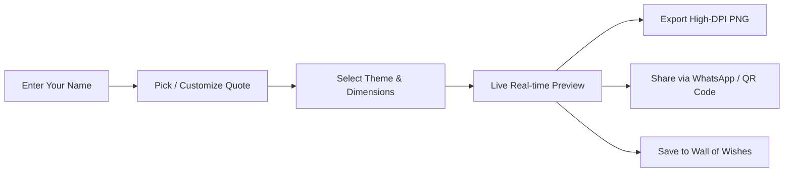

<div align="center">

# 🇮🇳 Happy Independence Day

<p align="center">
  <strong>A Luxury Patriotic Greeting Card Generator & Live Celebration Studio for India's Independence Day</strong>
</p>

<p align="center">
  <a href="https://react.dev/"></a>
  <a href="https://www.typescriptlang.org/"></a>
  <a href="https://vitejs.dev/"></a>
  <a href="https://tailwindcss.com/"></a>
  <a href="LICENSE"></a>
  <a href="https://github.com/Rahul08319/Happy_Independence_Day/pulls"></a>
</p>

---

<p align="center">
  
</p>

<p align="center">
  <a href="#-quick-tour--features"><b>✨ Explore Features</b></a> •
  <a href="#-card-themes-showcase"><b>🎨 Card Themes</b></a> •
  <a href="#-getting-started"><b>🚀 Quick Start</b></a> •
  <a href="#%EF%B8%8F-customization-guide"><b>⚙️ Customization</b></a> •
  <a href="#-tech-stack--performance"><b>⚡ Architecture</b></a>
</p>

</div>

---

## 📖 About The Project

> *"Freedom is not merely a political status, but a celebration of spirit, unity, and heritage."*

**Happy Independence Day** elevates traditional festive greetings into an **Apple-grade, designer web experience**. Built from the ground up with **React 18**, **TypeScript**, and **Tailwind CSS**, it features an interactive greeting card generator where anyone can personalize luxury patriotic greetings with memorable quotes from India's greatest freedom fighters, listen to an instrumental rendition of *Vande Mataram* with live visualizer bars, watch the live countdown clock to August 15th with rolling Apple Watch odometer digits, participate in an interactive flag hoisting ceremony with flower showers, and export print-ready high-DPI posters or instant WhatsApp links.

---

## ✨ Quick Tour & Features

<table>
  <tr>
    <td width="50%" valign="top">
      <h3>🎨 4 Luxury Designer Themes</h3>
      <p>Switch dynamically between <b>Royal Tiranga</b>, <b>Midnight Glow (OLED)</b>, <b>Heritage Ivory</b>, and <b>Vibrant Flag</b> styles with real-time canvas updates.</p>
    </td>
    <td width="50%" valign="top">
      <h3>⚡ Real-Time Card Studio</h3>
      <p>Watch your card update instantly as you type your name, select themes, or choose from inspiring patriotic quotes with interactive 3D perspective tilt.</p>
    </td>
  </tr>
  <tr>
    <td width="50%" valign="top">
      <h3>📜 Curated Historical Quotes</h3>
      <p>One-tap selector chips to apply quotes from <b>Netaji Subhash Chandra Bose</b>, <b>Shaheed Bhagat Singh</b>, <b>Gurudev Rabindranath Tagore</b>, <b>Dr. A.P.J. Abdul Kalam</b>, and patriotic Hindi poetry.</p>
    </td>
    <td width="50%" valign="top">
      <h3>📐 Multi-Format Export Engine</h3>
      <p>Export with tailored aspect ratios: <b>Story (9:16)</b> for WhatsApp/Instagram, <b>Square (1:1)</b> for social feeds, and <b>A4 Poster</b> for physical wall printing.</p>
    </td>
  </tr>
  <tr>
    <td width="50%" valign="top">
      <h3>🎵 Glassmorphic Audio Dock</h3>
      <p>Floating music widget streaming <i>Vande Mataram</i> with animated 4-band audio visualizer waves, polite autoplay detection, and mute control.</p>
    </td>
    <td width="50%" valign="top">
      <h3>⏱️ Live Neumorphic Countdown</h3>
      <p>Frosted-glass countdown clock calculating days, hours, minutes, and seconds until 15 August with Apple Watch rolling odometer digits and automatic year rollover.</p>
    </td>
  </tr>
  <tr>
    <td width="50%" valign="top">
      <h3>📱 WhatsApp & One-Click Sharing</h3>
      <p>Instant formatted sharing with emojis, custom link previews, and automatically generated high-contrast scannable QR codes.</p>
    </td>
    <td width="50%" valign="top">
      <h3>🌓 Royal Light & Midnight Dark Modes</h3>
      <p>Seamlessly toggle between daylight elegance and deep sapphire dark mode with persistent browser storage.</p>
    </td>
  </tr>
  <tr>
    <td width="50%" valign="top">
      <h3>🔄 Perpetual Multi-Year Engine</h3>
      <p>Automatically calculates future Independence Day years, dates, and grammatical ordinals (<b>79th</b> in 2026, <b>80th</b> in 2027, <b>81st</b> in 2028, <b>100th Centenary</b> in 2047) with midnight IST rollover.</p>
    </td>
    <td width="50%" valign="top">
      <h3>🏛️ Sacred Emblems of Our Nation</h3>
      <p>Interactive cultural accordion detailing the profound history, symbolism, and virtues of the <b>Tiranga</b>, <b>Ashoka Chakra</b>, <b>Lion Capital</b>, and national anthems.</p>
    </td>
  </tr>
  <tr>
    <td width="50%" valign="top">
      <h3>🌸 Pushpa Vrishti & Flag Hoisting</h3>
      <p>Interactive <b>Flag Hoisting (ध्वजारोहण)</b> ceremony with golden mast, unfurling Tiranga, trumpet fanfare audio, and 3D fluttering Marigold & Rose petal showers.</p>
    </td>
    <td width="50%" valign="top">
      <h3>🍏 Apple-Grade Fluid Motion Suite</h3>
      <p>Interactive <b>Cursor Spotlight</b>, <b>3D CardTilt</b> with specular sheen, <b>Magnetic Buttons</b> with spring physics, <b>Rolling Odometer Digits</b>, and rotating <b>Aurora Glow Borders</b>.</p>
    </td>
  </tr>
</table>

---

## 🎨 Card Themes Showcase

Every card theme has been handcrafted with deliberate attention to typography, contrast, and festive aesthetics:

```
┌────────────────────────────────────────────────────────────────────────┐
│                        INDIAN TRICOLOR PALETTE                         │
│                                                                        │
│   🟧 Saffron (#FF9933)    ⬜ Silk White (#FFFFFF)    🟩 India Green (#138808) │
│                                                                        │
│                ☸️ Royal Ashoka Navy (#000080)                           │
└────────────────────────────────────────────────────────────────────────┘
```

| Theme | Canvas Backdrop | Typography & Accents | Best Suited For |
| :--- | :--- | :--- | :--- |
| **👑 Royal Tiranga** | Silk Ivory with Gold Glow | Royal Navy `#000080` + Gold Leaf Foil | Family greetings & formal festival wishes |
| **🌌 Midnight Glow** | Obsidian Sapphire Gradient | Neon Saffron & Emerald `#38bdf8` | Dark-mode enthusiasts & OLED mobile screens |
| **📜 Heritage Ivory** | Antique Parchment Paper | Traditional Mahogany Serif + Mandala motifs | Cultural, historic, and poetic tributes |
| **🇮🇳 Vibrant Tiranga** | High-Saturation Tricolor Ribbons | Saffron Gradient + Crisp Emerald | Energetic WhatsApp statuses & youth celebrations |

---

## ⚙️ How It Works



1. **Input & Personalize**: Enter your name or family name.
2. **Select Quote Preset**: Choose from freedom fighter quotes or write your own heartfelt message.
3. **Choose Theme & Ratio**: Pick from 4 themes and toggle between Story (9:16), Square (1:1), or A4 Poster.
4. **Instant Export**:
   - Download crystal-clear PNG using dynamic high-pixel-ratio rendering.
   - Share to WhatsApp with pre-formatted patriotic emojis.
   - Scan the embedded QR code with any smartphone to open the personalized card directly.

---

## 🚀 Getting Started

Follow these steps to run the studio locally on your computer:

### Prerequisites

- [Node.js](https://nodejs.org/) (`v18.0.0` or later recommended)
- `npm` (comes with Node.js), `pnpm`, or `bun`

### Quick Start Commands

```bash
# 1. Clone the repository
git clone https://github.com/Rahul08319/Happy_Independence_Day.git

# 2. Enter directory
cd Happy_Independence_Day

# 3. Install dependencies
npm install

# 4. Start local development server
npm run dev
```

Open [http://localhost:5173](http://localhost:5173) in your browser to view the application.

### Available Scripts

| Command | Action |
| :--- | :--- |
| `npm run dev` | Starts Vite development server with Hot Module Replacement (HMR) |
| `npm run build` | Builds optimized production bundle in `/dist` directory |
| `npm run preview` | Previews the production build locally |
| `npm test` | Runs the Vitest test suite |
| `npm run lint` | Lints files using ESLint |

---

## 🛠️ Technology Stack & Performance

### Core Framework & Styling
- **[React 18](https://react.dev/)**: Component architecture with hooks (`useState`, `useRef`, `useMemo`, `useEffect`).
- **[TypeScript 5](https://www.typescriptlang.org/)**: Full type safety across themes, dimensions, and utility functions.
- **[Vite 5](https://vitejs.dev/)**: Sub-second Hot Module Replacement (HMR) and optimized Rollup bundling.
- **[Tailwind CSS 3](https://tailwindcss.com/)**: Utility-first styling with custom glassmorphism and keyframe animations.
- **[Radix UI / Shadcn](https://ui.shadcn.com/)**: Accessible, unstyled primitives for UI components.

### Graphics, Sound & Motion
- **[html-to-image](https://github.com/bubkoo/html-to-image)**: High-DPI canvas rasterization for PNG downloads without blur.
- **[canvas-confetti](https://www.kirilv.com/canvas-confetti/)**: Multi-stage tricolor particle celebration effects.
- **[Web Audio API](https://developer.mozilla.org/en-US/docs/Web/API/Web_Audio_API)**: Native synthesizer for haptic taps, victory chimes, fanfare, and acoustic chakra harmonics.
- **[Canvas 2D Particle Engine](https://developer.mozilla.org/en-US/docs/Web/API/CanvasRenderingContext2D)**: Real-time 3D fluttering Marigold & Rose petals (Pushpa Vrishti) and ambient particles.
- **[qrcode.react](https://github.com/zpao/qrcode.react)**: Inline vector SVG QR code generator with scannable contrast.
- **[Lucide React](https://lucide.dev/)**: Lightweight, clean iconography.
- **[Sonner](https://sonner.emilkowal.ski/)**: Toast notification library.

### Typography
- **[Cinzel](https://fonts.google.com/specimen/Cinzel)**: Majestic serif inspired by classical Indian & imperial inscriptions.
- **[Plus Jakarta Sans](https://fonts.google.com/specimen/Plus+Jakarta+Sans)**: Ultra-clean geometric sans-serif for UI readability.
- **[Playfair Display](https://fonts.google.com/specimen/Playfair+Display)**: Elegant display serif for greetings.

---

## 📁 Project Structure

```text
happy-independence-day/
├── public/
│   ├── favicon.ico              # Tricolor favicon
│   ├── og-image.jpg             # High-res OpenGraph preview
│   └── vandemataram.mp3         # Background patriotic anthem
├── src/
│   ├── components/
│   │   ├── ui/                  # Shadcn UI primitives (button, input, etc.)
│   │   ├── AnimatedNumber.tsx   # Apple Watch rolling digit odometer
│   │   ├── AudioDock.tsx        # Floating music widget with visualizer
│   │   ├── CardTilt.tsx         # 3D perspective card tilt with specular sheen
│   │   ├── CursorSpotlight.tsx  # Ambient cursor torch light
│   │   ├── FlagHoistModal.tsx   # Interactive Flag Hoisting ceremony
│   │   ├── FlowerShower.tsx     # 3D fluttering flower petal shower (Pushpa Vrishti)
│   │   ├── MagneticButton.tsx   # Apple spring-physics magnetic buttons
│   │   ├── NationalSymbols.tsx  # Interactive heritage accordion
│   │   ├── ParticleCanvas.tsx   # Ambient tricolor floating particle canvas
│   │   ├── RecentWishes.tsx     # Wall of saved wishes gallery
│   │   ├── SegmentedControl.tsx # Frosted glass segmented picker
│   │   └── ThemeToggle.tsx      # Dark / Light theme switcher
│   ├── lib/
│   │   ├── soundEffects.ts      # Web Audio API sound synthesis engine
│   │   └── wishUtils.ts         # Theme presets, quotes, sanitizers & multi-year engine
│   ├── pages/
│   │   ├── Index.tsx            # Main hero, studio, card renderer & countdown
│   │   └── NotFound.tsx         # 404 fallback page
│   ├── test/
│   │   ├── example.test.ts      # Base smoke tests
│   │   └── wishUtils.test.ts    # Unit tests for sanitizers & multi-year engine
│   ├── App.tsx                  # App routes and providers
│   ├── index.css                # Custom glassmorphism, animations & color tokens
│   └── main.tsx                 # React DOM mount point
├── tailwind.config.ts           # Custom fonts (Cinzel, Jakarta), colors & keyframes
├── vite.config.ts               # Vite configuration
└── package.json                 # Dependencies and build scripts
```

---

## ⚙️ Customization Guide

### Adding New Patriotic Quotes
Open [`src/lib/wishUtils.ts`](src/lib/wishUtils.ts) and add your quote to the `PATRIOTIC_QUOTES` array:

```typescript
export const PATRIOTIC_QUOTES = [
  // ...existing quotes
  {
    title: "Sardar Patel",
    text: "Manpower without unity is not a strength unless it is harmonized and united properly, then it becomes a spiritual power.",
    author: "Sardar Vallabhbhai Patel",
  },
];
```

### Adding a New Card Theme
Open [`src/lib/wishUtils.ts`](src/lib/wishUtils.ts) and define your theme in `CARD_THEMES`:

```typescript
export const CARD_THEMES: Record<CardTheme, CardThemeConfig> = {
  // Add custom styling tokens here
};
```

---

## 🔒 Privacy & Client-Side Architecture

- **100% Client-Side**: No personal names or customized messages are stored on any remote server.
- **URL-Encoded Sharing**: Shared wishes are encoded directly within URL query parameters (`?bl=...&msg=...`), allowing instant sharing without backend databases.
- **Local Storage**: Saved wishes are stored strictly on the user's local device browser storage.

---

## 🤝 Contributing

Contributions, feature suggestions, and pull requests are warmly welcomed!

1. Fork the Project (`https://github.com/Rahul08319/Happy_Independence_Day/fork`)
2. Create your Feature Branch (`git checkout -b feature/NewFeature`)
3. Commit your Changes (`git commit -m 'Add NewFeature'`)
4. Push to the Branch (`git push origin feature/NewFeature`)
5. Open a Pull Request

---

## 📜 License

Distributed under the **MIT License**. See [`LICENSE`](LICENSE) for details.

---

<div align="center">

### 🇮🇳 जय हिन्द · वन्दे मातरम् 🇮🇳
**Dedicated to the Republic of India & all freedom fighters who gifted us liberty.**

*Crafted with ❤️ and patriotic pride.*

</div>
